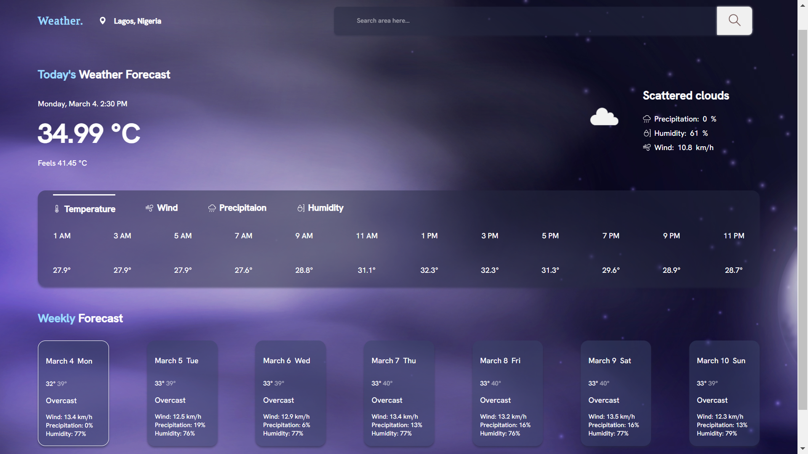

**WeatherApp**

WeatherApp is a simple and intuitive weather application built to provide users with accurate and up-to-date weather forecasts. Powered by real-time weather data sourced from reliable APIs, WeatherApp offers users the ability to quickly check the current weather conditions, hourly forecasts, and extended forecasts for any location worldwide.

**Key Features:**
- **Current Weather:** View the current temperature, humidity, wind speed, and other relevant weather data for your location.
- **Hourly Forecasts:** Access hourly forecasts to plan your day accordingly, with detailed information on temperature changes and weather conditions throughout the day.
- **Extended Forecasts:** Get a glimpse of the weather outlook for the upcoming days, including temperature trends and precipitation probabilities.
- **Location-based:** Automatically detects your location or allows you to search for weather information for any city or region globally.
- **User-friendly Interface:** Designed with simplicity and ease of use in mind, WeatherApp provides a clean and intuitive user interface for a seamless weather browsing experience.

**Technologies Used:**
- HTML, CSS, JavaScript for the frontend
- RESTful APIs for fetching weather data
- Bootstrap for responsive design
- [Insert any other relevant technologies]

**Screenshots:**
[Insert screenshots of the app in action]

**Try it Out:**
[Include a link to the live demo or instructions on how to run the app locally]

---

Feel free to customize the description to better reflect the unique features and functionalities of your weather app!

